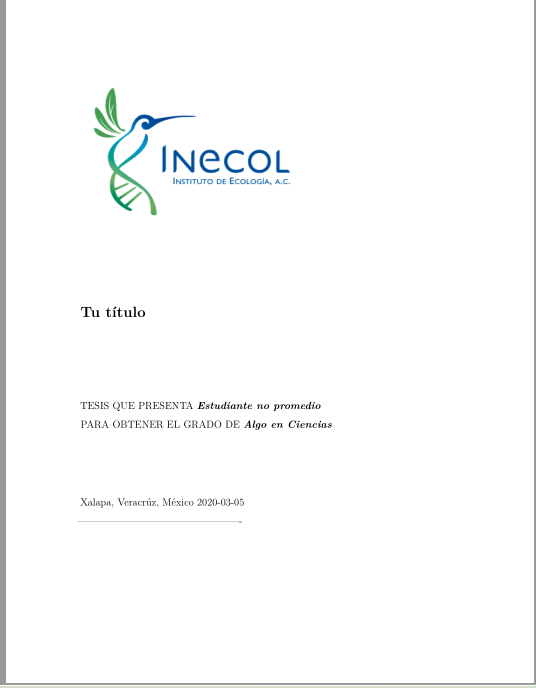

# LTX_Hummingbird

Esta es una versión de plantilla modificada de [`thesisdown`](https://github.com/ismayc/thesisdown) y con algunas ediciones para que funcione en español tomadas de [jcrodriguez1989](https://github.com/jcrodriguez1989/tesis_doctoral), para generar una tesis de posgrado siguiendo los lineamientos del [Instituto de Ecología A.C. (INECOL)] (https://www.inecol.mx/inecol/index.php/es/).

La plantilla aun esta en desarrollo y sujeta a modificaciones para ceñirse al formato al pie de la letra. Para consultar los lineamientos originales seguir el enlace [aquí](https://www.inecol.mx/posgrado/index.php/posgrado/tramites).



# Paquete `thesisdown`
Para correr la plantilla es necesario instalar el paquete de [`thesisdown`]https://github.com/ismayc/thesisdown). Pueden seguir su repositorio para instalar el paquete y entender su funcionamiento. Adicionalmente, es necesario instalar bookdown, Rmarkdown y un editor de Latex para generar los documentos en formatos en PDF

```{r}
if (!require("remotes")) install.packages("remotes", repos = "http://cran.rstudio.org")
remotes::install_github("rstudio/bookdown")
remotes::install_github("ismayc/thesisdown")
```
# Uso
Para usar la plantilla simplemente descarga o clona el repositorio en tu computador y abre el proyecto de R. Debido a que soy un novato en el lenguaje Latex la plantilla aun no esta terminada y posiblemente sufra muchas modificaciones hasta el día en que me gradúe. Siéntanse libre de explorar e incluso colaborar para mejorarla. Para ello lo mejor es crear un "branch" con sus cambios y darle pull request (Por favor abstenerse de modificar el documento original). Si no están familiarizados con github, por favor envíenme sus comentarios o ayudas al directamente al correo gabriel.andrade@posgrado.ecologia.edu.mx. Cada colaboración será reconocida.

# Funcionamiento y contenido
Para generar un documento pdf basta con abrir el archivo `index.Rmd` y apretar el botón `knit`. El documento resultado se alojará en la carpeta de thesis_output.

En la mayoría de los casos cada vez que avanzamos en los tutoriales es necesario entregar un documento en `word` para que los asesores realicen los comentarios. Son muy pocos los asesores que "admiten" la entrega de un PDF para una revisión, y aun menos los que pueden trabajar en github, que por cierto para mi es la forma más natural de trabajar un documento colaborativo generado en R. ¿Que hacer en esta instancia? Generar un PDF y luego pasarlo a word es una tarea muy desgastante. Pero no se preocupen, existe una función que nos permite generar un documento de word de cada capítulo y se ejecuta de manera muy sencilla. 

```{r}
bookdown::preview_chapter("01-chap2.Rmd",
                output_format = "bookdown::word_document2",
                output_file = paste0("thesis-chap2-", format(Sys.Date(), ("%d-%m-%y")), ".docx"),
                output_dir = "chapter-previews")
```
Este código genera un documento en word en la carpeta de "chapter-previews". Los problemas: 
 1) El formato no es el deseado: El documento de salida esta en un formato un poco "feo" como para entregárselo a un asesor, pero es mucho más sencillo de formatear que un archivo PDF convertido a word. Esto se corrige fácilmente con una plantilla base de word, pero aun estoy trabajando en ello.
 2) El código latex muere: Las tablas y figuras generadas con algún formato Latex no salen en el documento. Creo que es posible solucionar este problema (todo es posible en R), pero no he podido dar con el chiste hasta el momento. Por ahora la opción que existe es pegar todo manualmente, lo que se hace tedioso a medida que tenemos un documento más grande :(. 
 
 # Componentes
 
 
### `_bookdown.yml`
Este archivo es el que genera `bookdown`, y contiene las configuraciones básicas del archivo de tesis. Aquí se seleccionan los capítulos del documento, el orden, la carpeta de salida, entre otras cosas.

### `index.Rmd`
Es el archivo principal que contiene toda la información de meta datos del documento. Contiene los parámetros de autor, institución etc.

### `01-chap1.Rmd`, `02-chap2.Rmd`, etc.
Estos son los capítulos de la tesis y pueden tener el nombre que quieran, pero deben coincidir con los nombres que aparecen en el `_bookdown.yml`.

### `bib/`
Es el archivo donde se almacena la bibliografía del documento en formato `.bib`. Las citas en `Rmarkdown`pueden ser algo tediosas al principio, pero personalmente utilizo dos paquetes que facilitan muchísimo la vida y se complementan. El primero es [citr addin](https://github.com/crsh/citr) que ayuda a agregar citas de manera más sencilla y [BetterBibTeX](https://retorque.re/zotero-better-bibtex/) que conecta a `citr` con [Zotero](https://www.zotero.org/) y así exportar las citas mucho más fácil . 

### `csl/`
Es el archivo que especifica el estilo de la bibliografía. Para descargar más estilos pueden ir a https://github.com/citation-style-language/styles#readme

### `image/` y `data/`
Son las carpetas donde se almacenan las imágenes y los datos que se utilizan en los diferentes capítulos.

### detalles
 Para más detalles sobre los componentes y las funcionalidades de bookdown, es recomendadisimo ojear el libro de [bookdown book](https://bookdown.org/yihui/bookdown/).
 
# Retro-alimentación
Soy un novato en Latex y un entusiasta de R y Rmarkdown, por lo cual hay muchas cosas que voy descubriendo y mejorando sobre la marcha. Para mí y en general para los que comenzamos a escribir las tesis en esta herramienta, sería de mucha ayuda toda la retro-alimentación posible de personas que manejan el tema o incluso de gente como yo, que esta aprendiendo sobre la marcha. La idea final es generar una plantilla solida que sirva de base a estudiantes del INECOl que quieran hacer su tesis en Rmarkdown o incluso a aquellos a quienes los obliguen a hacerlo (no es cierto) .
